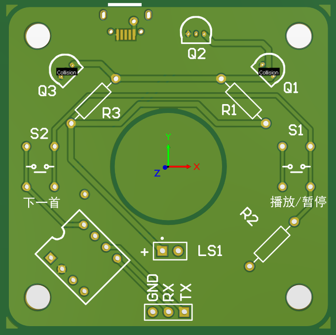
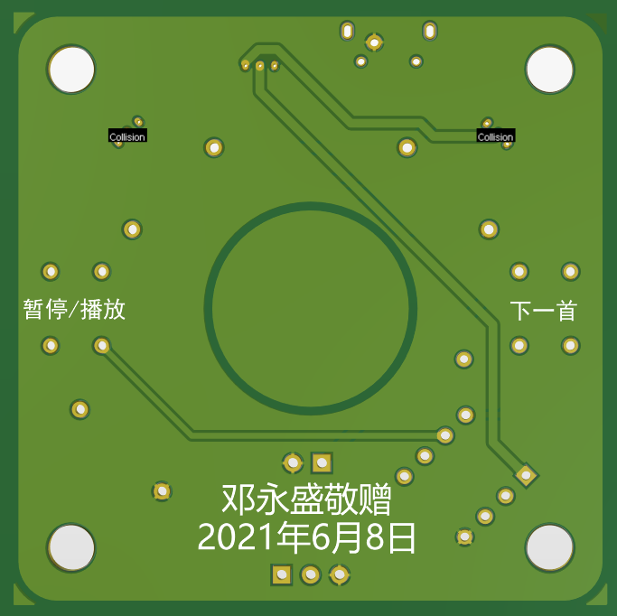
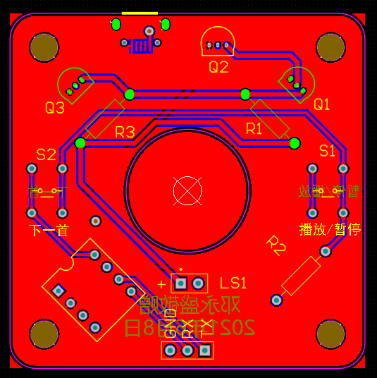
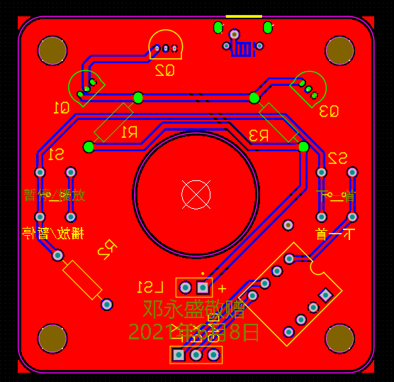

# 51单片机音乐盒

## 概述

​    这里使用51单片机来实现一个**电子音乐盒**。考虑到51单片机的存储空间通常在8k以内，无法保存完整的音频波形，我使用了类似于[自由钢琴 https://www.autopiano.cn/](https://www.autopiano.cn/)的方案来存储乐谱，使用定时器来播放乐谱。

## 音阶频率对照表

| 序号  | 按键  | 键名  | 唱名  | 频率          | 周期          | 定时器数值      | 定时器数值四舍五入 |
| --- | --- | --- | --- | ----------- | ----------- | ---------- | --------- |
| 10  | 0   | E3  | mi  | 163.4593718 | 0.006117728 | 62477.1359 | 62477     |
| 1   | 1   | C2  | do  | 67.04575098 | 0.014915188 | 58078.4059 | 58078     |
| 2   | 2   | D2  | re  | 74.02451059 | 0.013509039 | 58781.4805 | 58781     |
| 3   | 3   | E2  | mi  | 81.7296859  | 0.012235456 | 59418.2719 | 59418     |
| 4   | 4   | F2  | fa  | 90.23688916 | 0.011081942 | 59995.0288 | 59995     |
| 5   | 5   | G2  | so  | 99.62960307 | 0.010037177 | 60517.4113 | 60517     |
| 6   | 6   | A2  | la  | 110         | 0.009090909 | 60990.5455 | 60991     |
| 7   | 7   | B2  | si  | 121.4498465 | 0.008233851 | 61419.0743 | 61419     |
| 8   | 8   | C3  | do  | 134.091502  | 0.007457594 | 61807.2029 | 61807     |
| 9   | 9   | D3  | re  | 148.0490212 | 0.006754519 | 62158.7403 | 62159     |
| 21  | a   | B4  | si  | 485.799386  | 0.002058463 | 64506.7686 | 64507     |
| 34  | b   | A6  | la  | 1760        | 0.000568182 | 65251.9091 | 65252     |
| 32  | c   | F6  | fa  | 1443.790227 | 0.000692621 | 65189.6893 | 65190     |
| 23  | d   | D5  | re  | 592.1960848 | 0.00168863  | 64691.6851 | 64692     |
| 13  | e   | A3  | la  | 220         | 0.004545455 | 63263.2727 | 63263     |
| 24  | f   | E5  | mi  | 653.8374872 | 0.001529432 | 64771.284  | 64771     |
| 25  | g   | F5  | fa  | 721.8951133 | 0.001385243 | 64843.3786 | 64843     |
| 26  | h   | G5  | so  | 797.0368246 | 0.001254647 | 64908.6764 | 64909     |
| 18  | i   | F4  | fa  | 360.9475566 | 0.002770486 | 64150.7572 | 64151     |
| 27  | j   | A5  | la  | 880         | 0.001136364 | 64967.8182 | 64968     |
| 28  | k   | B5  | si  | 971.598772  | 0.001029231 | 65021.3843 | 65021     |
| 29  | l   | C6  | do  | 1072.732016 | 0.000932199 | 65069.9004 | 65070     |
| 36  | m   | C7  | do  | 2145.464031 | 0.0004661   | 65302.9502 | 65303     |
| 35  | n   | B6  | si  | 1943.197544 | 0.000514616 | 65278.6921 | 65279     |
| 19  | o   | G4  | so  | 398.5184123 | 0.002509294 | 64281.3528 | 64281     |
| 20  | p   | A4  | la  | 440         | 0.002272727 | 64399.6364 | 64400     |
| 11  | q   | F3  | fa  | 180.4737783 | 0.005540971 | 62765.5144 | 62766     |
| 14  | r   | B3  | si  | 242.899693  | 0.004116926 | 63477.5371 | 63478     |
| 22  | s   | C5  | do  | 536.3660078 | 0.001864399 | 64603.8007 | 64604     |
| 15  | t   | C4  | do  | 268.1830039 | 0.003728797 | 63671.6015 | 63672     |
| 17  | u   | E4  | mi  | 326.9187436 | 0.003058864 | 64006.568  | 64007     |
| 33  | v   | G6  | so  | 1594.073649 | 0.000627324 | 65222.3382 | 65222     |
| 12  | w   | G3  | so  | 199.2592061 | 0.005018589 | 63026.7057 | 63027     |
| 31  | x   | E6  | mi  | 1307.674974 | 0.000764716 | 65153.642  | 65154     |
| 16  | y   | D4  | re  | 296.0980424 | 0.00337726  | 63847.3701 | 63847     |
| 30  | z   | D6  | re  | 1184.39217  | 0.000844315 | 65113.8425 | 65114     |

## pcb设计效果

+ 正面

+ 背面

+ 正面

+ 背面

